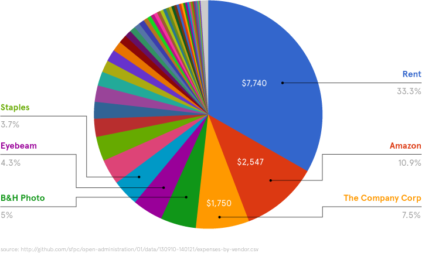

Hi all,

Today I’m happy to present you all with a report on _money_. 

Contents:

1. [$700 Tuition Refund](#700-tuition-refund)
2. [Forthcoming Expenses](#forthcoming-expenses)
3. [Transparency and Legibility](#transparency-and-legibility)
4. [Ways in Which Things are Complicated](#ways-in-which-things-are-complicated)
5. [Expenses by Category (chart and definitions)](#expenses-by-category)
6. [Expenses by Vendor (chart)](#expenses-by-vendor)
7. [Salaries](#salaries)
8. [“To Radical Openness and Generosity”](#to-radical-openness-and-generosity)

## $700 Tuition Refund

When Taeyoon and I went to set up the school’s bank account, he mentioned kind of off-the-cuff to our banker that “we don’t intend to grow-and-grow as a business.” I’m pretty sure that the banker’s head exploded.

Anyway, we always intended to give back any money that we didn’t spend to you, so today we’d like to offer each of you $700. If you email me back with your mailing address I will gladly cut you a check.

Also, let me know if you _don’t_ want your money back. We’d be grateful to put it towards next semester’s expenses. We’ve had a few brainstorming meetings about doing different kinds of programs in April, over the summer, and next fall.

## Forthcoming Expenses

As of January 21st, when I am writing this letter, our bank balance is $15,607.76. The reason I’m considering a $700 refund to be an emptying of our account is that we know we’re going to incur several expenses before taking in money for our next iteration:

| Item | Cost |
| ------ | ----- |
| Tuition refunds | $10,500 ($700 x 15 students) |
| Accountant | $1300 |
| Casey’s interim salary | $1000 (max interim amount based on $25/hr) |
| Website redesign (by Moises) | $1000 |
| Storage unit | $390 (3 months at $130/mo) |
| QuickBooks Online | $60 (3 months at $20/mo) |
| Taxes | TBD |

So, if everyone takes their refund that brings us down to $5107.76. Our interim expenses add up to at least $3750, bringing the balance down to $1357.76. That makes $700 the roundest hundred we can give back.

Going forward I want to work to lower the amount of money we need students to front while spending less to increase the amount we can give back. By understanding our costs, being super thrifty, and pushing hard on sponsorships (which we definitely didn’t devote enough hours to this time around) to cover salaries, space, and materials, we can get better and better at this over time.

## Transparency and Legibility

Without further ado: I’m attaching a [**Profit & Loss Detail statement** (pdf)](https://github.com/SFPC/finance-and-administration/blob/master/01/data/130910-140121/as-exported/pdf/profit-and-loss-detail.pdf?raw=true) recently exported from our accounting software QuickBooks. This includes a line item for every incoming and outgoing transaction on our books, sorted by category.

Transparency...accomplished! Just kidding. One comment I saw over-and-over in your survey comments (stay tuned for those in a separate thread) was that _transparency_ does not equal _legibility_. Put another way: just because you were all shared on my Google Spreadsheets doesn’t mean that I’m doing an adequate job telling the story of what’s going on with your money. That’s exactly right. 

## Ways in Which Things are Complicated

Here’s just a few examples of how: 

- **Multiple payment methods**: We accepted money in the form of checks, PayPal, Quickpay, wire transfers, and cash. This complicates reporting considerably. If cash is spent before it is deposited it doesn’t show up on the books. Also, payments from Paypal were sometimes lumped together into big transfers from a Paypal balance to our account. Bookkeeping often takes some forensics between the websites of multiple financial institutions, so I went through Paypal matching everything up and double-checking to split these into individual students’ payment records in QuickBooks. Additionally, different payment methods take out different fees. We decided to eat all fees and consider payments round, so whether your payment method charged us $5 or $15 on a $500 payment we considered you squared away.
- **Cash purchases made with cash income**: On one occasion we used a student’s cash payment to buy our projector from a Craigslist seller without first depositing it. This is legit but it doesn’t show up on the books. In the future I’m reccomending that we run everything through the account, just for seamless recordkeeping, though it can create delays and increase administrative overhead.
- **Multiple bank accounts**: The teachers were so excited to get started with classes that we started SFPC without a bank account. Or rather, we started with a sub-bank account of Zach’s studio YesYesNo and switched over to an independent account once our LLC paperwork had cleared. So at one point we transferred about $30,000 between accounts. Luckily QuickBooks was able to pull transactions from both accounts and we have good records, but ended up having to reconcile two bank accounts and two PayPals.
- **Opting not to move money in circles**: In order to not move money back-and-forth between accounts a bunch of times Zach was paid his salary directly from checks and payments to YesYesNo that hadn’t been deposited by the time we had already transferred that account’s entire balance to the SFPC LLC. account. So although Zach’s salary was officially $10,000, we cut him a check for a remainder of just $598, while noting the full amount on the memo.
- **Granularity**: The highest level of granularity you’ll get from these spreadsheets is oftentimes something like AMAZON.COM. When I’ve had a question about something, we’re small enough that I’ve been able to track down the receipt in somebody’s inbox. But going forward I'll actively be filing _everyone's_ print and email receipts for _everything_ (not just for reimbursements) in QuickBooks to help draw a finer line between spending categories. This would also pave the way for a fun (and nerdy) visualization project, keeping count of things like the amount of toilet paper rolls we buy so that we can place informed bulk orders in the future.

All of these exceptions are why I breathed a deep sigh of relief when our accountant Katia informed me that our accounts had been properly reconciled, meaning everything’s accounted for.

## Expenses by Category

On October 25th, I signed us up for [QuickBooks Online](http://QuickBooks.intuit.com/), which is standard accounting software for small businesses. It’s software-as-a-service, meaning it’ll cost us $20 forever, but the clarity it has allowed me is priceless. QuickBooks allows me to categorize expenses and income by category, as well as to print checks which are immediately logged with their appropriate memo and category. Going forward I’ll also use QuickBooks to take care of payroll, invoices, receipts, and some payments. As tax day rolls around, our accountant is able to plug right in and take care of her tasks.

While QuickBooks allows for a freakishly detailed level of record keeping, it took me a little while to grasp some of the accounting terminology, so I wanted to walk through our spending categories.

### Subcontractors

This is code for "people": teachers, an administrator, and guest artists. In the next section I give a more granular breakdown of these costs.

### Office Expenses

Office expenses are the little things it takes to exist in a space (not including rent) from toilet paper to furniture to flowers to fruit-fly traps.

### Rent or Lease

This was our home base at 33 Flatbush. We had agreed to pay Al a percentage of the money we took in. This was dispersed in three monthly installments of $2000, plus an extra $1500 at the end.

### Supplies

Supplies consists of books for the school's library, electronics for circuits class (lots and lots of electronics), materials needed for student or visiting artist workshops, and final exhibition costs (including things like space rental and postcards).

### Legal & Professional Fees

We've only got one expense in this category but it's a big one: the $1750.13 fee we paid to The Company Corporation to become SFPC, LLC. When we pay our accountant Katia, her services will show up here too.

### Meals and Entertainment

Pizza and beer for us all. And lots of Grubhub during the last two weeks. (This doesn't include Thursday dinners, which had crowdsourced ingredients.)

### Travel

A few Taxis and one gigantic SUV summoned to IKEA to bring back a bookcase and other things for the space.

### Utilities

As it turns, commercial internet is almost prohibitively expensive. We were able to pay our friends on the 7th floor $120 a month to up their bitrate and drop a line (literally, down the building) to us. Extreme cheap-skating, and it worked alright too!

### Stationery & Printing

Rush-ordered some sfpc cards to hand out at Maker Faire, the first weekend everyone was in town.

### Entertainment

$150 of beer. QuickBooks has finicky definitions of nearly identical categories like “Entertainment and Meals” versus pure “Entertainment”, so going forward I will try to keep things simple by recategorizing cases like this where beer purchases have ended up under both “meals” and “entertainment” categories.

## Expenses by Vendor

This chart represents the _things_ we bought (meaning it excludes salaries of teachers, staff, and visitors), as listed by the item's vendor.

## Salaries

People (or “subcontractors” to use accounting parlance) are the school’s biggest expense, so I wanted to provide a better breakdown of those costs based on the profit and loss.

For administration, the teachers offered me an hourly rate of $25 at a projected 20 hours a week, although I track my hours and am paid based on my actual time working, not a flat fee or projection. Anecdotally, this is $10 more per hour than most of my friends make in NYC working jobs in and outside of the field of arts and culture, but it is less than I make doing freelance web design.

The idea behind teacher salaries at SFPC was to do better than the downright offensive rates that most colleges offer [adjunct professors](http://adjuncts.chronicle.com). (One adjunct professor at my alma mater noted that she was forced to resign because she could make more money on food stamps than teaching for a semester, and if she was considered employed she would be unable to defer her own student loans.) So, the formula that the teachers came up with was:

`$150/hr x 3 hours per class x 10 weeks of class = $4500`

And the classes, as offered, were:

| Teacher | Class |
| ------- | ----- |
| Jen Lowe | Math for Artists / Art for Mathists |
| Jen Lowe | Dinner Studio |
| Zach Lieberman | Learning to Learn |
| Zach Lieberman | Input/Output |
| Taeyoon Choi | Circuits and Drawings |
| Taeyoon Choi | Art of Walking |
| Amit Pitaru | Learning Curves |

Theoretically, this would’ve resulted in the following salaries:

| Name | Role | Formula | Salary |
| ---- | ---- | ------- | ------ |
| Taeyoon Choi | Teacher | 2 classes x 3 hours x $125/hr x 10 week semester | $9,000 |
| Zach Lieberman | Teacher | 2 classes x 3 hours x $125/hr x 10 week semester | $9,000 |
| Jen Lowe | Teacher | 2 classes x 3 hours x $125/hr x 10 week semester | $9,000 |
| Amit Pitaru | Teacher | 1 class x 3 hours x $125/hr x 10 week semester | $4,500 |
| **Total** ||| **$31,500** |

However, we underestimated the amount of time it would take to run the school. Therefore, because Jen and Amit were both holding down full-time jobs which were a commute away, Taeyoon and Zach ended up doing a bunch of administrative work and spending more time at the school than they had budgeted. It was decided that we could round their salaries up to $10,000. Jen generously donated the bulk of her salary for teaching two classes, accepting only $2000 in payment, and Amit generously donated his entire salary of $5,000 for teaching one class, accepting no payment.

So, after including yet-to-be-paid maximum of $1000 interim administrative salary for myself and an extra $1500 for Taeyoon to organize and plan the next iteration of sfpc, the salaries came out the the following:

| Name | Role | Salary |
| ---- | ---- | ------ |
| Taeyoon Choi | Teacher + Administrator | $11,500 |
| Zach Lieberman | Teacher | $10,000 |
| Casey Gollan | Administrator | $8,378 |
| Jen Lowe | Teacher | $2,000 |
| Amit Pitaru | Teacher | $0 |
| **Total** || **$31,878** |

We feel strongly about paying visiting artists, critics, and lecturers who came to give talks, lead workshops. 

<<<<<<< HEAD
##Updates about Visiting Artists fee

* Shortly after we published this document and information about visiting artist's fee, we got a response from one of the visiting artists that we should have informed them before publishing this document. We acknowledge this is our shortcoming and we are editing out the information until we get everyone's approval. 
* There was a general consensus that the school is operating on opensource ideology: in it's teaching methodology as well as administration. The faculty and students were well aware of the fact the school's finance will be published openly at some point. Although we did our best to inform visiting artists, we could have done a better job in communicating clearly about the ways which we decided to share this information. Please understand this school is a continuing work in progress and we are learning every step of the way. Thank you - taeyoon choi.  
=======
Below is the complete list of people we paid, by fee:

**NOTE: Shortly after we published this document and information about visiting artist's fee, we got a response from one of the visiting artists that we should have informed them before publishing this document. We acknowledge this is our shortcoming and we are editing out the information until we get everyone's approval.**

** There was a general consensus that the school is operating on opensource ideology: in it's teaching methodology as well as administration. The faculty and students were well aware of the fact the school's finance will be published openly at some point. Although we did our best to inform visiting artists, we could have done a better job in communicating clearly about the ways which we decided to share this information. Please understand this school is a continuing work in progress and we are learning every step of the way. Thank you - taeyoon choi.**
>>>>>>> 65fdfad906d13dc81bbe9b3c641803cf3f831618

| Name | Role | Fee |
| ---- | ---- | --- |
| Caitlin Morris | Visiting Artist | $  |
| Jürg Lehni | Visiting Artist | $  |
| Marcela Godoy | Visiting Artist | $  |
| Jacob Tonski | Visiting Artist | $  |
| Dan Phiffer | Visiting Artist | $  |
| Gabriella Levine | Visiting Artist | $  |
| Jeff Feddersen | Kitchen Table Coders | $ |
| Ted Hayes | Kitchen Table Coders | $  |
| David Nolen | Kitchen Table Coders | $  |
<<<<<<< HEAD
| Christine Sun Kim| Guest Lecture | $  |
=======
| Christine Sun Kim | Guest Lecture | $  |
>>>>>>> 65fdfad906d13dc81bbe9b3c641803cf3f831618
| Jacob Gaboury | Guest Lecture | $ |
| Kyle McDonald | Guest Lecture | $  |
| Brian Droitcour | Guest Lecture | $   |
| Mmuseumm Curator | Art of Walking Fieldtrip | $  |

All of the teachers invited guests to the school, so the invitations varied. For example, some visitors were very casual, like Zach Gage and Golan Levin; some asked if they can visit; and other visitors were scheduled months in advance. Many, or Most, of the visiting artists came to SFPC with the spirit of sharing their practice and support for the community. Money was not an issue with the visiting artists. There were many more visiting artists who came for free and share so much of their insights. We thank them greatfully with respect and love. 

Visiting artists list include special guests speakers for our opening event: Bret Victor and Ramsey Nassar, and Eva Schindling, Jesse Louis-Rosenberg, Brian House, Joanne McNeil, Syd Lieberman, Adam Magyar, Takahiro Yamaguchi, Cederic Kiefer, Giorgia Lupi, Gabriele Rossi, Paola Antonelli. There were at least a dozen more artists and engineers who came to visit our Thursday Open Dinners. SFPC was a community experience at it's best, and we will do our best to acknowledge everyone who made it special. 

Also to note, many visitors were paid just for the actual cost of visiting SFPC. The fee for Jurg Lehni was to cover bus from Boston, flight change difference (he originally had flight from Boston back to Switzerland) and a bus from NYC to JFK. It's just an example of visiting artist's willingness to cooperate with our school's mission toward lower cost, accessible education of art and technology. 
 

As you can see, the fees also vary widely, even within categories. One reason is that we wanted to compensate visiting artists proportional to their time commitment and level of involvement, ranging from an hour long artist talk to a week long teaching residency. Another reason for the spectrum is external funding. Jacob Tonski, for example, visited for the same amount of time as Caitlin Morris, but he was able to obtain a travel grant from the university where he teaches, and he agreed that we could simply match that. 

As with most things this first semester, we had to figure out visiting artist fees as we went along. Our methodology at this point is to look at the circumstances of each visit and work out a fee that both the school and the visitor can agree is fair.

## “To Radical Openness and Generosity”

I was equal parts excited and reluctant to take a job as an “administrator” because I’ve got lots of ideas but little in the way of qualifications or experience. And in my own experience at school I’ve found administrators to be dead-in-the-eyes, old (like...almost dying), bitter, slow, encumbered, opaque, unhelpful — I could go on. I’d like to do better than that, and when I saw the spirit of the school that Zach, Taeyoon, Jen, and Amit had begun to articulate, I knew this could be a chance. 

One phrase from the website’s [about page](http://sfpc.io/about) has stuck with me in particular: “To radical openness and generosity.” That’s the kind of thing I want inscribed over a doorway, so I can pass through it every day! While you guys were asking questions from the technological (what is the difference between wifi and bluetooth?) to the anthropomorphic (how do I know the computer understands me?), my question was: what could it look like to open source this school?

I’m hoping that this letter did a good job of explaining things. But I’m almost positive you’re left with questions, ideas, and other kinds of feedback. Please let me know! This is my first time organizing a school and I’m eager to hear from you guys about what can be better at every step of the process.

Amit, Andy, Claire, Ishac, Jason, Jen, Jesse, Jonathan, Jonathan, Le, Mini, Moises, Motoi, Paul, Rachel, Simona, Taeyoon, Tega, Zach — thank you,

Casey Gollan, Administrator  
[casey@sfpc.io](mailto:casey@sfpc.io)
